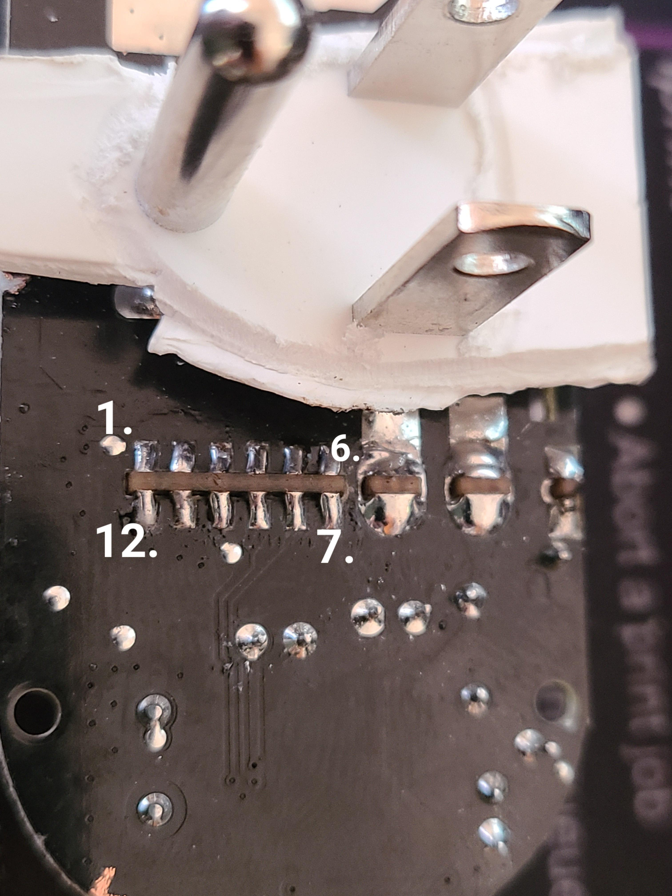

# Emporia EMS01 ESPHome Flashing Guide

This guide explains how to reflash the **Emporia EMS01** with ESPHome. The process requires physically opening the device and connecting a USB-to-serial UART adapter to the exposed programming pins.

⚠️ **Warning:** Proceed at your own risk. Modifying the EMS01 may void warranties and involves working with mains-powered hardware. Ensure the device is **completely disconnected from power** before beginning.

---

## Requirements

* Emporia EMS01
* USB to Serial UART adapter (3.3V logic level)
* Dupont jumper wires
* Soldering iron or test clips (recommended for stable connections)
* ESPHome or ESP Web Tools for flashing

---

## Hardware Preparation

1. Cut open the EMS01 carefully to expose the PCB.
2. Modify the back cover (as needed) to allow access to the programming pins.
3. Identify the pins as shown below:

### Pinout Reference

```
 1.  3v3 (Power)
 4.  RX (Connect to TX of USB adapter)
 7.  GND (Ground)
 9.  TX (Connect to RX of USB adapter)
12.  GPIO0 (Hold low while booting to enter flash mode)
```



---

## Flashing Instructions

1. Connect the USB-to-serial adapter to the EMS01 pins:

   * Adapter **3.3V** → Pin **1 (3v3)**
   * Adapter **TX** → Pin **4 (RX)**
   * Adapter **RX** → Pin **9 (TX)**
   * Adapter **GND** → Pin **7 (GND)**

2. To enter flash mode:

   * Hold **Pin 12 (GPIO0)** low (connect to GND).
   * While holding low, power the device via **3v3**.
   * Release after boot.

3. Use **ESP Web Tools** or `esphome-flasher` to upload your ESPHome firmware.

4. Once flashing is complete, disconnect GPIO0 from GND and reboot.

---

## Notes

* Ensure you are using **3.3V** only. Using 5V may damage the chip.
* After flashing, you can configure the EMS01 in ESPHome as desired.
* I actually took the small board off because I needed to see where the pinouts were, so I haven't actually flashed it with connected. I'll try to get more and test.
* See the .yaml for config

---

## Credits
* Got the orignal yaml from here: [https://devices.esphome.io/devices/emporia_smart_plug/main]
* Community guides for Emporia EMS01 modifications
* ESPHome Project: [https://esphome.io](https://esphome.io)

---
